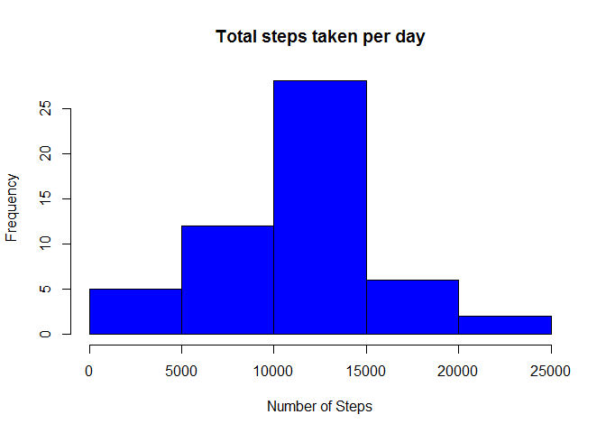
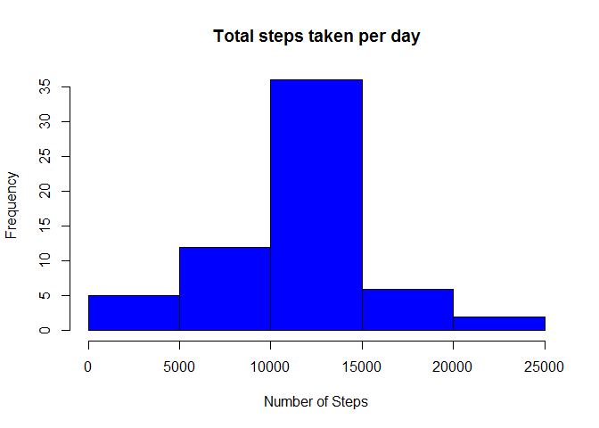

# Reproducible Research: Peer Assessment 1
Bern Reyes  
January 2017  


## Loading and preprocessing the data

```r
setwd("C:/Users/Peesonal/Documents/Dette/Coursera/Git/RepData_PeerAssessment1")
unzip(zipfile="activity.zip")
data <- read.csv("activity.csv")
```


```r
#create subdirectory figures and put the plots here
knitr::opts_chunk$set(fig.path="figures/")
```

## What is mean total number of steps taken per day?

```r
totalsteps <- aggregate(steps ~ date, data, sum)
hist(totalsteps$steps, main = paste("Total steps taken per day"), col="blue", xlab="Number of Steps")
```

<!-- -->

```r
meantotal <- mean(totalsteps$steps)
mediantotal <- median(totalsteps$steps)
```

The mean steps taken each day is 1.0766189\times 10^{4}.
The median steps taken each day is 10765.


## What is the average daily activity pattern?
* Calculate average steps for each interval for all days. 
* Plot the Average Number Steps per Day by Interval. 
* Find interval with most average steps. 

```r
meansteps <- aggregate(steps ~ interval, data, mean)
plot(meansteps$interval,meansteps$steps, type="l", main="Average Number of Steps per Day by Interval", xlab="Interval", ylab="Number of Steps")
```

<!-- -->

```r
max_meanstep <- meansteps[which.max(meansteps$steps),1]
```

The interval with most average steps is 835.

## Imputing missing values
* Calculate and report the total number of missing values in the dataset (i.e. the total number of rows with NAs)

```r
missing <- is.na(data$steps)
table(missing) #number of missing values
```

```
## missing
## FALSE  TRUE 
## 15264  2304
```

* Devise a strategy for filling in all of the missing values in the dataset. The strategy does not need to be sophisticated. For example, you could use the mean/median for that day, or the mean for that 5-minute interval, etc.

* Create a new dataset that is equal to the original dataset but with the missing data filled in.


```r
#use the mean of the 5-min interval for imputing the missing values
meansteps <- aggregate(steps ~ interval, data, mean)

imputedData <- transform(data, steps = ifelse(is.na(data$steps), meansteps$steps[match(data$interval, meansteps$interval)], data$steps))
```

* Make a histogram of the total number of steps taken each day and Calculate and report the mean and median total number of steps taken per day. Do these values differ from the estimates from the first part of the assignment? What is the impact of imputing missing data on the estimates of the total daily number of steps?


```r
totalstepsImputed <- aggregate(steps ~ date, imputedData, sum)
hist(totalstepsImputed$steps, main = paste("Total steps taken per day"), col="blue", xlab="Number of Steps")
```

<!-- -->

```r
meantotalImputed <- mean(totalstepsImputed$steps)
mediantotalImputed <- median(totalstepsImputed$steps)
meantotal_diff <-meantotalImputed - meantotal
mediantotal_diff <- mediantotalImputed - mediantotal

#check the total value for the date with all missing data
totalstepsImputed[as.character(totalstepsImputed$date)=="2012-10-01",] #total steps for 10/1/2012 is 10766.19
```

```
##         date    steps
## 1 2012-10-01 10766.19
```

```r
#the imputed value to the missing values is the same with the mean total number of steps before imputation
```

* The mean steps taken each day before imputation is 1.0766189\times 10^{4}.
* The median steps taken each day before imputation is 10765.
* The mean steps taken each day after imputation is 1.0766189\times 10^{4}.
* The median steps taken each day after imputation is 1.0766189\times 10^{4}.
* The difference in the mean steps taken each day before vs after imputation is 0. 
* Imputation has a little impact in the median total number of steps. The difference in the median values before and after imputation is 1.1886792.

## Are there differences in activity patterns between weekdays and weekends?

```r
weekday <- c("Monday", "Tuesday", "Wednesday", "Thursday", "Friday")
imputedData$day = as.factor(ifelse(is.element(weekdays(as.Date(imputedData$date)),weekday), "Weekday", "Weekend"))
meanstepsWithWeek <- aggregate(steps ~ interval + day, imputedData, mean)

library(lattice)
xyplot(meanstepsWithWeek$steps ~ meanstepsWithWeek$interval|meanstepsWithWeek$day, 
main="Average Steps per Day by Interval",xlab="Interval", ylab="Steps",layout=c(1,2), type="l")
```

<!-- -->
